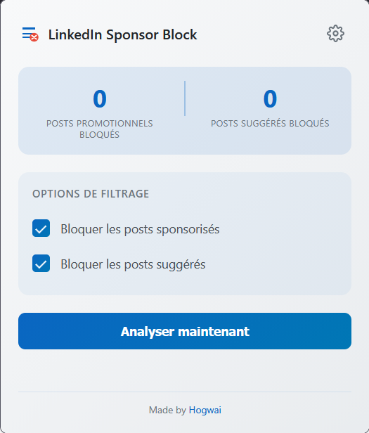
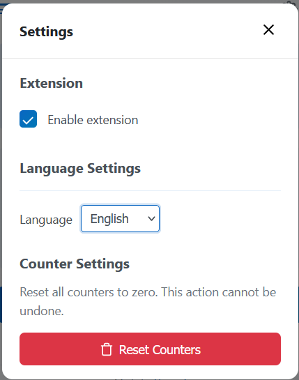
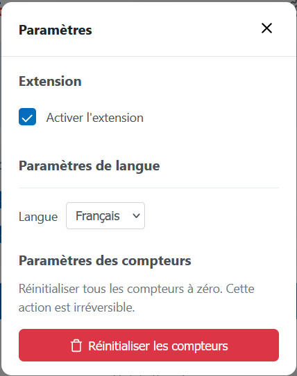
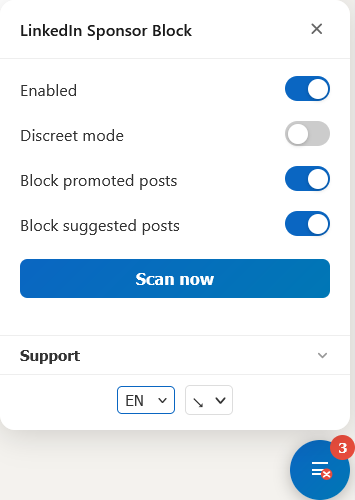

# LinkedinSponsorBlock

**Clean up your LinkedIn feed and see only what matters.**

Tired of sponsored posts, suggested content, or partner promotions cluttering your feed? **LinkedinSponsorBlock** automatically removes these "promotion" posts, giving you a cleaner, more productive LinkedIn experience.

These posts look like regular updates but are labeled **"Promotion."** Even standard ad blockers often miss them — this extension catches and hides them silently.

## Preview

### Popup

| English | Français |
|:-------:|:--------:|
|  |  |

### Settings

| English | Français |
|:-------:|:--------:|
|  |  |

### Userscript

| English | Français |
|:-------:|:--------:|
|  |  |

## Features

- 🚫 **Automatic removal** – Hides sponsored posts, suggested content, and partner promotions
- 🌐 **Multilingual support** – Works with all languages available on LinkedIn
- 🌍 **Localized UI** – Extension interface available in English and French
- ⚡ **Lightweight & discreet** – Runs in the background without slowing your browsing
- 💼 **Focused feed** – Concentrate on the content that actually matters to you
- 📊 **Counter tracking** – See how many posts have been blocked
- ⚙️ **Customizable filters** – Choose what to block (promoted, suggested, or both)

Perfect for professionals, recruiters, or regular LinkedIn users who want a more relevant and distraction-free feed.

## Installing

### Firefox Extension

### Chrome Extension

### Userscript

#### Prerequisites

- A compatible web browser (Google Chrome, Firefox, Edge, etc.)
- The **Tampermonkey** extension installed

#### Installing Tampermonkey

- **Google Chrome**: Go to the [Chrome Web Store](https://chromewebstore.google.com/detail/tampermonkey/dhdgffkkebhmkfjojejmpbldmpobfkfo?pli=1) and click "Add to Chrome"
- **Firefox**: Go to [Mozilla Add-ons](https://addons.mozilla.org/fr/firefox/addon/tampermonkey/) and click "Add to Firefox"
- **Other browsers**: Search for "Tampermonkey" in your browser's extension store (Edge, Opera, etc.)

#### Installing the LinkedinSponsorBlock script

1. **From Greasyfork:**
   - Go to the script page: [LinkedinSponsorBlock](https://greasyfork.org/fr/scripts/546877-linkedinsponsorblock)
   - Click "Install this script" and confirm

2. **From GitHub:**
   - Click here: [LinkedinSponsorBlock.user.js](https://github.com/Hogwai/LinkedinSponsorBlock/releases/download/userscript-v1.2.0/LinkedinSponsorBlock.user.js) to install directly
   - Or browse the userscript releases: [Releases](https://github.com/Hogwai/LinkedinSponsorBlock/releases?q=userscript&expanded=true)

3. **Verify that the script is enabled:**
   - In the Tampermonkey dashboard (click the icon > "Dashboard"), ensure that the `LinkedinSponsorBlock` script is enabled (switch to "On")

#### Usage

- Visit [linkedin.com/feed](https://www.linkedin.com/feed/)
- Open the browser console (`F12` > Console) to view logs (e.g., how many ads were removed)

#### Troubleshooting

**Script not working?**

- Verify that Tampermonkey is enabled and that the script is correctly installed
- Ensure that the site URL matches the script's `@match` patterns (`https://www.linkedin.com/feed/*`)
- Check the browser console for error messages
- On Google Chrome, you will have to allow userscripts:

**Persistent issues?**

- Open an issue via [GitHub](https://github.com/Hogwai/LinkedinSponsorBlock/issues) or try to update the script

## License

This project is licensed under the MIT License.
