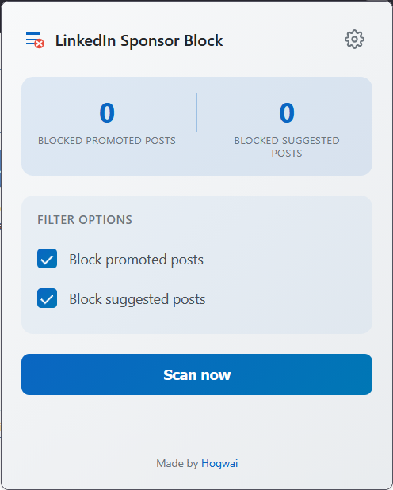
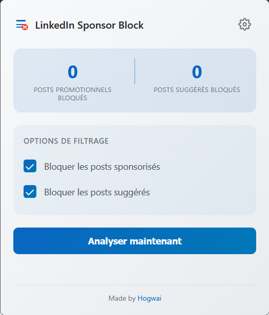
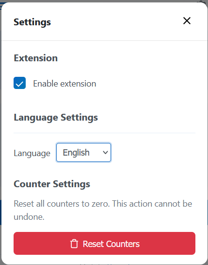
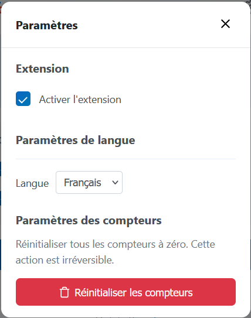
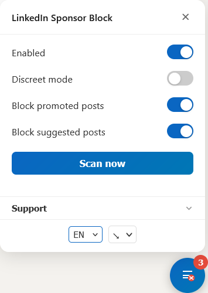

# LinkedinSponsorBlock

**Clean up your Linkedin feed and see only what matters.**

Tired of sponsored posts, suggested content, or partner promotions cluttering your feed? **LinkedinSponsorBlock** automatically removes these "promotion" posts, giving you a cleaner, more productive Linkedin experience.

These posts look like regular updates but are labeled **"Promotion."** Even standard ad blockers often miss them, this extension catches and hides them silently.

## Table of Contents

- [Preview](#preview)
- [Features](#features)
- [Installation](#-installation)
  - [Google Chrome & Chromium-based browsers](#-google-chrome--chromium-based-browsers)
  - [Firefox Extension](#-firefox-extension)
  - [Userscript (Tampermonkey)](#-userscript-tampermonkey)
- [Detailed Installation Guide](#-detailed-installation-guide)
  - [Prerequisites](#prerequisites)
  - [Installing Tampermonkey](#installing-tampermonkey)
  - [Installing the script](#installing-the-linkedinsponsorblock-script)
  - [Usage](#usage)
  - [Troubleshooting](#troubleshooting)
- [Support](#support)
- [License](#license)

## Preview

<b>📸 Click to view screenshots</b>

### Popup

| English | Français |
|:-------:|:--------:|
|  |  |

### Settings

| English | Français |
|:-------:|:--------:|
|  |  |

### Userscript

| English | Français |
|:-------:|:--------:|
|  |  |

## Features

- 🚫 **Automatic removal** – Hides sponsored posts, suggested content, and partner promotions
- 📱 **Desktop & mobile** – Works on both desktop and mobile versions of Linkedin (Firefox & userscript)
- 🌐 **Multilingual support** – Works with all languages available on Linkedin
- 🌍 **Localized UI** – Extension interface available in English and French
- ⚡ **Lightweight & discreet** – Runs in the background without slowing your browsing
- 💼 **Focused feed** – Concentrate on the content that actually matters to you
- 📊 **Counter tracking** – See how many posts have been blocked
- ⚙️ **Customizable filters** – Choose what to block (promoted, suggested, or both)

Perfect for professionals, recruiters, or regular Linkedin users who want a more relevant and distraction-free feed.

---

## 📥 Installation

Choose your preferred installation method:

### 🌐 Google Chrome & Chromium-based browsers

Available on the [Chrome Web Store](https://chromewebstore.google.com/detail/linkedin-sponsor-block/dmgglmnbmokkdocpamjkcgjfjceoocbh) for Chrome and all Chromium-based browsers:

### 🦊 Firefox Extension

### 🔧 Userscript (Tampermonkey)

---

## 📖 Detailed Installation Guide

### Userscript Installation

#### Prerequisites

- A compatible web browser (Google Chrome, Firefox, Edge, etc.)
- The **Tampermonkey** extension installed

#### Installing Tampermonkey

- **Google Chrome**: Go to the [Chrome Web Store](https://chromewebstore.google.com/detail/tampermonkey/dhdgffkkebhmkfjojejmpbldmpobfkfo?pli=1) and click "Add to Chrome"
- **Firefox**: Go to [Mozilla Add-ons](https://addons.mozilla.org/fr/firefox/addon/tampermonkey/) and click "Add to Firefox"
- **Other browsers**: Search for "Tampermonkey" in your browser's extension store (Edge, Opera, etc.)

#### Installing the LinkedinSponsorBlock script

1. **From Greasyfork:**
   - Go to the script page: [LinkedinSponsorBlock](https://greasyfork.org/fr/scripts/546877-linkedinsponsorblock)
   - Click "Install this script" and confirm

2. **From GitHub:**
   - Click here: [LinkedinSponsorBlock.user.js](https://github.com/Hogwai/LinkedinSponsorBlock/releases/download/userscript-v1.2.7/LinkedinSponsorBlock.user.js) to install directly
   - Or browse the userscript releases: [Releases](https://github.com/Hogwai/LinkedinSponsorBlock/releases?q=userscript&expanded=true)

3. **Verify that the script is enabled:**
   - In the Tampermonkey dashboard (click the icon > "Dashboard"), ensure that the `LinkedinSponsorBlock` script is enabled (switch to "On")

#### Usage

- Visit [linkedin.com/feed](https://www.linkedin.com/feed/)
- Open the browser console (`F12` > Console) to view logs (e.g., how many ads were removed)

#### Troubleshooting

**Script not working?**

- Verify that Tampermonkey is enabled and that the script is correctly installed
- Ensure that the site URL matches the script's `@match` patterns (`https://www.linkedin.com/feed/*`)
- Check the browser console for error messages
- On Google Chrome, you will have to allow userscripts:

**Persistent issues?**

- [Report an issue](https://tally.so/r/QKrO28) or open an issue via [GitHub](https://github.com/Hogwai/LinkedinSponsorBlock/issues), or try to update the script

---

## Support

Found this project useful? Consider supporting its development:

- ⭐ Star this repository
- 💬 Leave a review:
  - [Chrome Web Store](https://chromewebstore.google.com/detail/linkedin-sponsor-block/dmgglmnbmokkdocpamjkcgjfjceoocbh/reviews)
  - [Firefox Add-ons](https://addons.mozilla.org/en-US/firefox/addon/linkedin-sponsor-block/reviews/)
  - [Greasyfork](https://greasyfork.org/fr/scripts/546877-linkedin-sponsor-block/feedback)
- 🐛 [Report an issue](https://tally.so/r/QKrO28)

## License

This project is licensed under the MIT License.
